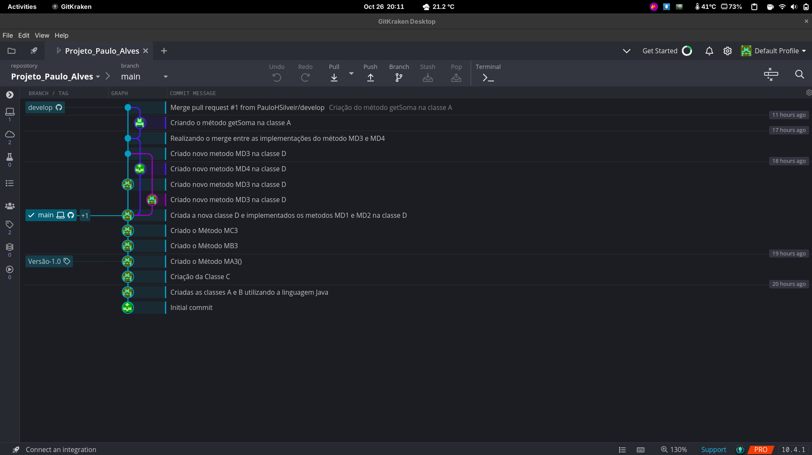

## Projeto Paulo Alves

Projeto simples realizado na disciplina de Engenharia de Software da UFLA, sobre o uso de ferramentas para gestão de versões de projetos de software, no qual foi introduzida a ferramenta Git.

